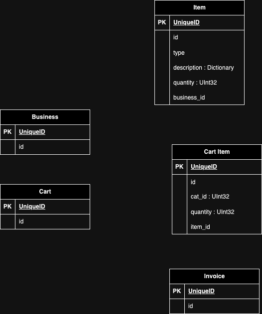

# Chess Server 

*** The project is currently in development ***

# Table of Content

- [Introduction](#introduction)
- [Requirements](#requirements)
- [Technology](#technology)
- [Development](#development)
    - [Run](#run)
- [Production](#production)
- [Model](#model)
- [Endpoints](#rest-endpoints)
- [Directory](#directory)
- [Reference](#reference)
- [Changelog](#changelog)

# Introduction

*** Some fancy introduction here ***

# Technology

- Python 3
    - FastAPI
    - Uvicorn
    - Pydantic
    - Websocket
- MongoDB
- Redis
- Prometheus
- Grafana

# Development

1. Clone repository
2. Create a virtual environment
3. Source the virtual environment
4. Run pip install -r requirements.txt  

## Run
(Source virtual environment if not done)
1. Change directory to ./server/source
2. Run chmod +x dev_run.sh dev_run_uvicorn.sh 
3. Run dev_run.sh

# Production

```
cd small_business_server/server/
docker compose up
```


# Model




# REST Endpoints

| HTTP      | Endpoint           | Description |
| --------- | ------------------ |  ---------- |
|  POST     | /business/         | Create a business
|  GET      | /business/         | Get a business
|  GET      | /business/         | List business
|  PUT      | /business/         | Update business
|  DELETE   | /business/         | Delete business
|  POST     | /cart/             | Create a cart
|  GET      | /cart/             | Get a cart
|  GET      | /cart/             | List cart
|  PUT      | /cart/             | Update cart
|  DELETE   | /cart/             | Delete cart
|  POST     | /cartitem/         | Create a cart item
|  GET      | /cartitem/         | Get a cart item
|  GET      | /cartitem/         | List cart item
|  PUT      | /cartitem/         | Update cart item
|  DELETE   | /cartitem/         | Delete cart item
|  POST     | /invoice/          | Create a invoice
|  GET      | /invoice/          | Get a invoice
|  GET      | /invoice/          | List invoice
|  PUT      | /invoice/          | Update invoice
|  DELETE   | /invoice/          | Delete invoice
|  POST     | /item/             | Create a item
|  GET      | /item/             | Get a item
|  GET      | /item/             | List item
|  PUT      | /item/             | Update item
|  DELETE   | /item/             | Delete item


# Development Process

- Draw IO
    - Review Model
    - Does model require update?
        - Yes - Update
- Express
    - MongoDB
        - Reflect model from DrawIO into MongoDB Mongoose

    - Endpoints
        - For each existing endpoint
            - Review
            - Does endpoint require update?
                - Yes - Update
        - New endpoints?
            - Add new endpoints
    - Main
        - Review file
        - Does main require update?
            - Yes - Update

    - PM2
        - Review each PM2 script
        - Update each PM2 script if needed

    - Test
        - Mocha

- Docker 
    - Dockerfiles
        - For each Dockerfile
            - Review
            - Update
    - Build
        - For each Docker build script,
            - Review
            - Update
    - Run
        - For each Docker run script,
            - Review
            - Update 
    - Compose
        - Review compose.yaml and update if needed.
        - Review each compose script
        - Update each compose script if needed

- Lint
- Deploy

# Reference

TBD

# ChangeLog

TBD